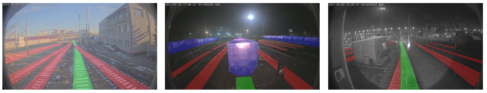

# Railway Infrastructure Segmentation
Author: Viacheslav Barkov

## Purpose of work
Develop an algorithm for determining railway infrastructure components, specifically the railway gauge and rolling stock. The developed algorithm can be used to prevent emergencies on the railroad. The task contains several primary tasks of determining the elements of road infrastructure: gauge (railroad ties) and rolling stock (locomotives, freight cars, passenger cars).

## Solution
The solution consists of multiple diverse semantic segmentation models, which are aggregated using ensemble modeling. These models include a PAN (Pyramid Attention Network) decoder and the following encoders: EfficientNet B4, NFNet with ECA and SiLU, SE-ResNet. 
Training was performed using Google Colab with a Tesla P100 GPU.

## Results
[Railway_Infrastructure_Segmentation](Railway_Infrastructure_Segmentation.ipynb) - Jupyter Notebook with data exploration, training, evaluation, ensembling and prediction. The notebook is also available on [Google Colab](https://colab.research.google.com/drive/1J6kwJ4-BIY_f1unTFi7Zh2E6I2yCTxiR) with additional environment setup specifically for Google Colab. 
The weights of the trained models and training history can be found in the [Github Releases](https://github.com/slavabarkov/railway-infrastructure-segmentation/releases) section and are also available on [Google Drive](https://drive.google.com/drive/folders/1NgPEgN2azZ_I7hPiESbTdO0O2xhYjfyd).

